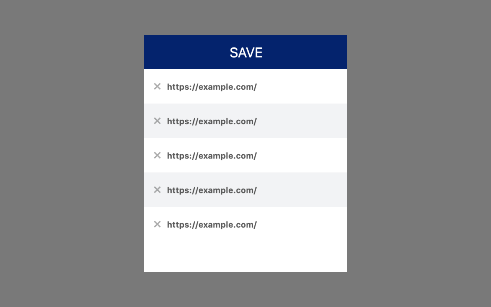

# Progress Bookmark
This is a simple chrome extension, to store the current progress / scroll percentage of a website or long blog post. 

You can add the extension to your browser here: [https://chrome.google.com/webstore/detail/progress-bookmark/kpibpmoaggofblbgbecmnlmnacjlglbk](https://chrome.google.com/webstore/detail/progress-bookmark/kpibpmoaggofblbgbecmnlmnacjlglbk)

## Usage
With a click on **SAVE** the current site and scroll percentage is saved. Clicking on the website will restore the site and scroll automatically to the last location.

## Contribute
If you find any bugs or missing any features get in touch or directly open a PR.

## License
MIT. See license file.